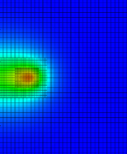

# Thermal Simulation of Arc Welding with AMR



WELDSIM is an AMReX-based program for simulating heat-transfer during arc-welding in plates. It uses the finite-volume method combined with adaptive mesh refinement to solve a transient, nonlinear heat equation that models the transfer of thermal energy from the welding electrode to the plate specimen.

# Installation

Begin by cloning into the repository:
```
git clone github:dlmpal/weldsim.git
```

Once inside the weldim directory, run: 
```
make AMREX_HOME=/path/to/amrex
```

The variable **AMREX_HOME** should be the root directory of AMReX in your machine. Other variables (e.g. the use of MPI or the compiler type) can be set inside the GNUmakefile directly. After *make* has completed execution, either your 2D or 3D binary will be available.

# Usage
Simply run the weldsim executable in the command line, passing the input file as the first argument. A sample input file is provided under the run folder (**run/input**).